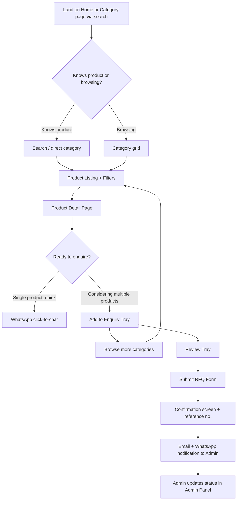
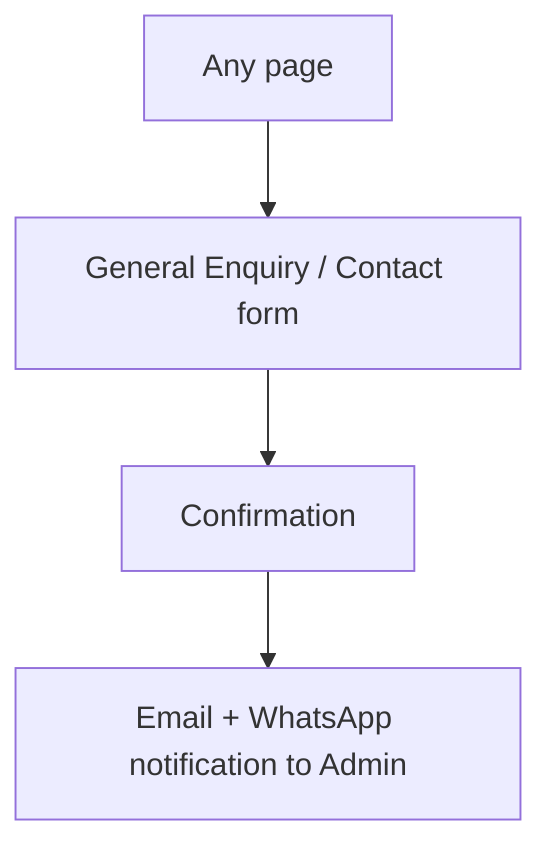

# OM Polyplast — Product Requirements Document (PRD)

Status: v1.0 · Owner: Product · Consumers: all workstreams
Related: `design.md`, `TRD.md`, `architecture.md`, `admin-panel-spec.md`

---

## 1. Vision

OM Polyplast currently sells through word-of-mouth, trade directories (IndiaMART/TradeIndia-style listings), and direct relationships. The site's job is narrow and specific: **turn organic and local search traffic into qualified RFQs (request-for-quote) and phone/WhatsApp enquiries**, while giving non-technical staff full control over the product catalog without developer involvement.

This is not an e-commerce store (no cart/checkout — see §6) and not a brand marketing site. It is a **lead-generation catalog** for a B2B manufacturer, judged on RFQ volume and quality, not on session duration or pageviews.

## 2. Personas

| Persona | Context | Needs from the site |
|---|---|---|
| **Priya, Procurement Manager** at a mid-size FMCG/e-commerce fulfillment company | Sources packaging materials in bulk, compares 3–4 suppliers before issuing a PO, reports to a manager who wants a spec sheet on file | Fast spec comparison, downloadable spec sheet, credible trust signals (GST, years in business), a quote turnaround-time promise |
| **Rakesh, Wholesale Trader** | Resells packaging materials to small retailers/kirana distributors in his region, often orders by phone after finding a supplier online | Clear MOQ and pricing-on-request flow, WhatsApp as the primary contact channel (dominant in this trade), mobile-first experience |
| **Sana, Export Sourcing Agent** | Sources packaging for an overseas buyer, needs to verify manufacturing capability and compliance before recommending a supplier | Facility/production credibility (About page), certifications, clear company registration details, easy general enquiry path |

## 3. User Stories

| ID | As a... | I want to... | So that... | Priority |
|---|---|---|---|---|
| US-1 | Buyer | browse products by category | find relevant items without knowing exact product names | P0 |
| US-2 | Buyer | filter products by size/thickness/type | narrow results to what fits my use case | P0 |
| US-3 | Buyer | see full specs on a product page | confirm it meets my requirement before contacting the seller | P0 |
| US-4 | Buyer | add multiple products to one enquiry | request a bulk quote across several SKUs in a single submission | P0 |
| US-5 | Buyer | contact via WhatsApp directly from a product page | use the channel I already use for business, without filling a form | P0 |
| US-6 | Buyer | download a spec sheet PDF | share it internally for approval | P1 |
| US-7 | Buyer | submit a general enquiry not tied to a specific product | ask a question before knowing exactly what I need | P0 |
| US-8 | Admin/Sales staff | see all incoming quotes and enquiries in one place | respond promptly without checking email, WhatsApp, and phone logs separately | P0 |
| US-9 | Admin/Sales staff | update a quote's status (new/contacted/quoted/won/lost) | track pipeline without a separate CRM | P0 |
| US-10 | Admin (non-technical) | add/edit/remove products and categories myself | keep the catalog current without paying a developer for every change | P0 |
| US-11 | Admin | edit page SEO fields (title/meta/OG image) per page | control search-result appearance without code changes | P1 |
| US-12 | Buyer (mobile) | find the phone number/WhatsApp instantly on any page | contact quickly on a small screen | P0 |
| US-13 | Admin | receive an email/WhatsApp notification the moment an RFQ is submitted | respond within the promised time window | P0 |

## 4. Feature List

### P0 — Launch blockers
- Product catalog: categories, subcategories, product listing, product detail pages
- Full-text + facet filtering (type, size/thickness, application)
- Single-product and multi-product ("quote basket") RFQ flow
- General contact/enquiry form
- WhatsApp click-to-chat integration (FAB + per-product button)
- Admin panel: CRUD for products, categories, quotes, enquiries; RFQ/enquiry status workflow
- Email + WhatsApp notification on new RFQ/enquiry
- Responsive design (mobile/tablet/desktop/large screens)
- On-page SEO fundamentals: meta control per page, sitemap.xml, robots.txt, structured data (Organization, LocalBusiness, Product, BreadcrumbList)
- Google Analytics 4 + Search Console + Google Business Profile linkage

### P1 — Fast-follow
- Downloadable per-product spec sheet (PDF)
- Admin-editable homepage sections (trust bar stats, featured products) without redeploy
- Product-level FAQ (feeds FAQ schema)
- Multi-role admin access (Sales vs. Content Editor vs. Super Admin — see `admin-panel-spec.md`)
- Basic search (typeahead across product names/SKUs)

### P2 — Backlog / explicitly deferred
- Blog / articles section — **excluded per client decision**; SEO strategy instead leans on category/product depth and local landing content (see `content-strategy.md`)
- Multilingual (Gujarati/Hindi) — deferred; architecture should not block adding it later (see `TRD.md` §Internationalization)
- Customer login / order history
- Live chat widget beyond WhatsApp deep-link
- CRM integration beyond the built-in admin quote pipeline

## 5. User Flows

## 6. Explicitly Out of Scope

- Online payments or checkout — this is a quote-driven B2B sales model, not e-commerce.
- Multi-vendor marketplace features.
- Blog/content hub (per client decision — catalog-only).
- Real-time inventory sync with any ERP (unless client confirms an existing system to integrate with — [TO BE CONFIRMED]).
- Customer accounts/login.
- Native mobile app.

## 7. Acceptance Criteria (key flows)

**RFQ submission (single or multi-product):**
- Given a buyer has added ≥1 product to the enquiry tray, when they submit the form with valid name/phone/company, then a Quote record is created in the admin with status `New`, a confirmation screen with a reference number is shown, and an email + WhatsApp notification is sent to the configured admin recipient within 1 minute.
- Given required fields are missing or invalid, when the buyer submits, then inline field-level errors are shown and no Quote record is created.
- Given the honeypot/Turnstile check fails, when the form is submitted, then the submission is silently discarded and logged, and the user still sees a generic confirmation (avoids tipping off bots) — [confirm this UX trade-off with client; alternative is to show an error].

**Catalog browsing:**
- Given a buyer applies a filter combination with no matching products, when the page updates, then an empty state with a "clear filters" action and a WhatsApp fallback CTA is shown (never a dead-end blank page).

**Admin catalog management:**
- Given a non-technical admin user, when they create a new product with required fields (name, category, at least one image, specs), then the product is published and appears on the live site within the ISR revalidation window (see `architecture.md` §Caching) without any developer involvement.

## 8. Success Metrics

| Metric | Target (initial 6 months) | Source |
|---|---|---|
| Qualified RFQs/month | Baseline in month 1, then track month-over-month growth | Admin panel quote count |
| Organic sessions from Rajkot/packaging keyword clusters | Track ranking + traffic growth for target terms in `content-strategy.md` | Search Console + GA4 |
| RFQ form completion rate (starts → submits) | ≥ 60% | GA4 event funnel |
| Core Web Vitals (LCP/CLS/INP) | All "Good" per Google thresholds | PageSpeed Insights / CrUX |
| Google Business Profile actions (calls, direction requests) | Track month-over-month growth | GBP Insights |
| Admin task: add a new product | ≤ 5 minutes, no developer involvement | Qualitative — admin panel usability |

Note: no historical baseline exists (no prior site) — month 1–2 data becomes the baseline; treat early targets as directional, not committed SLAs.

## 9. Open Items Requiring Client Input

- [TO BE CONFIRMED] Exact product catalog (real SKUs, specs, images) — see `admin-panel-spec.md` for what fields to prepare.
- [TO BE CONFIRMED] Preferred RFQ response-time promise to display to buyers (e.g., "within 24 business hours").
- [TO BE CONFIRMED] Whether an existing ERP/inventory system needs integration.
