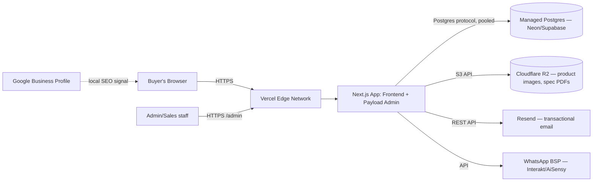

# OM Polyplast — Technical Requirements Document (TRD)

Status: v1.0 · Owner: Engineering · Consumers: developer, DevOps
Related: `architecture.md` (implementation detail), `PRD.md` (feature scope), `admin-panel-spec.md`

Client decisions locked for this version: **Next.js** (frontend/framework), **CMS/admin: recommended below**, **no blog**.

---

## 1. Tech Stack

| Layer | Choice | Rationale |
|---|---|---|
| Frontend framework | **Next.js 16** (App Router, TypeScript, React Server Components) | Client-selected. Current stable/Active-LTS line as of this writing; server components + ISR are a strong fit for a content-heavy, SEO-critical catalog. |
| CMS / Admin | **Payload CMS 3.x** (self-hosted, installed directly into the Next.js `/app` directory) | See §2 for the full comparison. Chosen because Quotes and Enquiries are *application data with a workflow*, not just editorial content — Payload can model products, categories, quotes, and enquiries as one unified backend with one admin login, instead of pairing a content-only headless CMS with a second custom backend for the RFQ pipeline. |
| Database | **PostgreSQL**, via a serverless-friendly managed provider (e.g., Neon or Supabase) | Relational structure suits Product↔Category and Quote↔Product↔Buyer relationships better than a document store; serverless Postgres avoids running/patching a database server yourself. |
| Media storage | **S3-compatible object storage** (e.g., Cloudflare R2 — no egress fees, meaningfully cheaper than S3 for an image-heavy catalog) | Payload's upload plugin supports S3-compatible adapters directly; keeps product images out of the app's deploy bundle and off local disk (required for serverless hosting). |
| Styling | **Tailwind CSS** + the token set in `design.md` §2 | Utility-first speeds up build of the dense, table-heavy layouts this catalog needs; tokens are wired in as Tailwind theme extensions, not ad hoc hex values in components. |
| Hosting | **Vercel** (Next.js + embedded Payload admin, same deployment) | Payload 3's Next.js-native architecture deploys anywhere Next.js does; Vercel gives zero-config preview deployments, edge caching, and image optimization out of the box. |
| Transactional email | **Resend** (or plain SMTP if the client has an existing provider) | Simple API, good deliverability, low cost at this volume. |
| WhatsApp | **WhatsApp Business Platform** via a BSP (e.g., Interakt or AiSensy) for the notification side; a plain `wa.me` deep link for the buyer-facing click-to-chat button (no API needed for that direction) | Buyer-to-seller contact needs no API — it's just a link. Seller-side automated notifications (new RFQ alert) benefit from a BSP rather than the raw Meta Cloud API, given no dedicated dev-ops resource is assumed. [TO BE CONFIRMED: budget for a paid BSP plan vs. email-only notifications at launch]. |
| Analytics | Google Analytics 4, Google Search Console, Google Business Profile | Free, standard, sufficient for this project's scale; see `content-strategy.md` for what to track. |
| Bot/spam protection | Cloudflare Turnstile + honeypot field on all public forms | Free, privacy-respecting alternative to reCAPTCHA. |

## 2. CMS Decision Detail

The client asked for a recommendation. Three options were weighed:

| Option | Pros | Cons | Verdict |
|---|---|---|---|
| **Payload CMS 3.x** (recommended) | Single Next.js codebase (CMS lives inside `/app`); code-first schema in TypeScript gives full type safety; built-in auth/access-control granular enough to separate Sales staff (quotes/enquiries only) from Content Editors (catalog only); products, categories, quotes, *and* enquiries are all just Payload "collections" — no second backend needed for the RFQ pipeline | Admin UI is functional but less polished than Sanity's for non-technical editors; smaller plugin ecosystem than Strapi, so some integrations may need custom code; self-hosting is your responsibility (Payload Cloud has paused new-project onboarding as of this writing — plan around self-hosting, not the managed offering) | **Recommended.** The RFQ/Enquiry workflow requirement tips this decision — it needs a real backend with relations and status fields, which a pure content CMS doesn't give you for free. |
| Sanity | Best-in-class editorial UX (Studio); generous free tier; fully managed (no server ops) | Purely a content layer — Quotes/Enquiries would still need a separate custom backend (e.g., a Postgres + API routes setup), effectively building two systems instead of one; recurring platform cost scales with content/traffic | Strong alternative if the client's team will be *very* frequent, non-technical content editors and is willing to accept a second system for the RFQ pipeline. |
| WordPress (headless or classic) | Extremely familiar to most Indian web agencies/freelancers, huge plugin ecosystem, cheap hosting | Fighting the platform to model Quotes/Enquiries as structured workflow data (vs. generic post types) is awkward; performance and Core Web Vitals require more manual work; doesn't align with the client-selected Next.js frontend without a heavier headless setup | Not recommended given Next.js is already decided. |

## 3. Hosting & Deployment Topology

Deployment notes:
- Single Vercel project serves both the public site and `/admin` (Payload's recommended embedded pattern) — one deploy pipeline, one bill, no "CMS is down but the site is up" split-brain failure mode.
- Environment variables (DB connection string, R2 keys, Resend key, WhatsApp BSP key, Payload secret) managed via Vercel's encrypted project settings — never committed to git.
- Preview deployments on every pull request for design/content review before merge.

## 4. Security

| Concern | Approach |
|---|---|
| Admin authentication | Payload's built-in auth (email + password, with option to add 2FA later); rate-limited login attempts |
| Role-based access | Three roles minimum: Super Admin, Sales (Quotes/Enquiries only), Content Editor (Products/Categories only) — see `admin-panel-spec.md` §Permissions |
| Public form abuse | Cloudflare Turnstile + honeypot field + server-side rate limiting (per-IP) on RFQ and contact form submission endpoints |
| Data in transit | HTTPS everywhere (enforced by Vercel by default) |
| Data at rest | Managed Postgres provider's default encryption at rest; no sensitive payment data is ever collected (no checkout — see `PRD.md` §6) |
| Dependency hygiene | Automated dependency update PRs (e.g., Dependabot/Renovate); track Next.js security releases (Next.js has moved to a formal, regular security-release cadence as of 2026 — subscribe to release notes) |
| Backups | Automated point-in-time recovery via the managed Postgres provider; R2 versioning enabled on the media bucket |

## 5. Performance Budgets

| Metric | Budget | Notes |
|---|---|---|
| LCP (Largest Contentful Paint) | < 2.5s on 4G mid-tier mobile | Product images served via `next/image` + R2, responsive `srcset`, priority-loaded above the fold only |
| CLS (Cumulative Layout Shift) | < 0.1 | Reserve image/aspect-ratio boxes; no layout-shifting ad/embed content |
| INP (Interaction to Next Paint) | < 200ms | Keep filter/tray interactions client-light; avoid heavy client bundles on catalog pages |
| JS payload (initial route) | < 170KB gzipped | Lean on React Server Components; hydrate only interactive islands (filters, tray, forms) |
| Image weight (product thumbnail) | < 80KB (WebP/AVIF via `next/image`) | |

## 6. Browser Support

Last 2 versions of Chrome, Safari, Edge, Firefox; iOS Safari and Chrome Android (mobile is the dominant traffic source for this buyer segment — see `content-strategy.md`). No IE11 support.

## 7. Internationalization (deferred, but don't architect against it)

English-only at launch per current decision. Payload has built-in field-level localization — when/if Gujarati or Hindi is added (P2, see `PRD.md`), it should be additive (new locale fields) rather than a rebuild. No action needed now beyond avoiding hardcoded, non-localizable strings in shared components.

## 8. Open Items Requiring Client Input

- [TO BE CONFIRMED] Budget approval for a paid WhatsApp BSP plan vs. starting with email-only notifications and adding WhatsApp automation later.
- [TO BE CONFIRMED] Existing domain registrar/DNS provider, or new domain purchase needed.
- [TO BE CONFIRMED] Any existing ERP/inventory system requiring integration.
