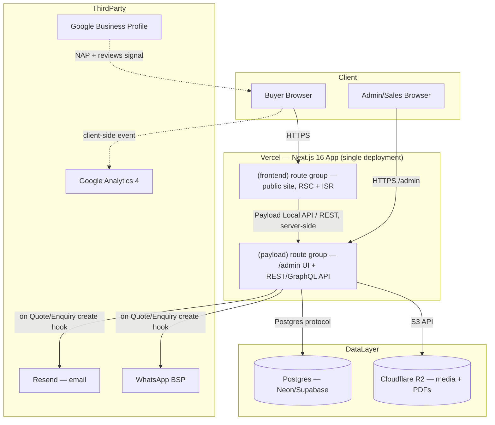

# OM Polyplast — System Architecture

Status: v1.0 · Owner: Engineering · Consumers: developer / AI coding agent
Related: `TRD.md` (stack rationale), `admin-panel-spec.md` (admin UX built on these models)

---

## 1. High-Level System Diagram



Key architectural decision: the public frontend calls Payload through its **server-side Local API** (in-process function calls within the same Next.js app) for page rendering, not over HTTP — this avoids a network round-trip per page and is the main practical benefit of the "CMS embedded in the frontend app" model described in `TRD.md`. The public-facing REST/GraphQL API is used only for the RFQ/enquiry form submissions from the client.

---

## 2. Data Models

All models are Payload **collections**, defined in TypeScript config (code-first — no GUI schema builder). Shown below as simplified field lists; see inline Payload config comments for validation rules.

### 2.1 Category

```typescript
// collections/Categories.ts
{
  slug: 'categories',
  fields: [
    { name: 'name', type: 'text', required: true },
    { name: 'slug', type: 'text', required: true, unique: true, index: true },
    { name: 'description', type: 'richText' },        // used for category-page SEO copy
    { name: 'heroImage', type: 'upload', relationTo: 'media' },
    { name: 'parent', type: 'relationship', relationTo: 'categories' }, // optional, for subcategories
    { name: 'seo', type: 'group', fields: [
        { name: 'metaTitle', type: 'text' },
        { name: 'metaDescription', type: 'textarea' },
      ]},
    { name: 'order', type: 'number' },                 // manual display ordering
  ],
}
```

### 2.2 Product

```typescript
// collections/Products.ts
{
  slug: 'products',
  fields: [
    { name: 'name', type: 'text', required: true },
    { name: 'slug', type: 'text', required: true, unique: true, index: true },
    { name: 'sku', type: 'text', unique: true },
    { name: 'category', type: 'relationship', relationTo: 'categories', required: true, hasMany: false },
    { name: 'shortDescription', type: 'textarea', required: true },
    { name: 'description', type: 'richText' },
    { name: 'images', type: 'upload', relationTo: 'media', hasMany: true, minRows: 1 },
    { name: 'specs', type: 'array', fields: [             // renders as the Spec Table component
        { name: 'label', type: 'text', required: true },   // e.g. "Thickness"
        { name: 'value', type: 'text', required: true },   // e.g. "40 micron"
      ]},
    { name: 'applications', type: 'array', fields: [
        { name: 'industry', type: 'text' },
      ]},
    { name: 'moq', type: 'text' },                        // free text, e.g. "500 rolls" — [TO BE CONFIRMED real values]
    { name: 'specSheetPdf', type: 'upload', relationTo: 'media' }, // P1 feature
    { name: 'featured', type: 'checkbox', defaultValue: false },  // drives homepage "featured products"
    { name: 'inStock', type: 'checkbox', defaultValue: true },
    { name: 'faqs', type: 'array', fields: [               // P1, feeds FAQ schema
        { name: 'question', type: 'text' },
        { name: 'answer', type: 'textarea' },
      ]},
    { name: 'seo', type: 'group', fields: [
        { name: 'metaTitle', type: 'text' },
        { name: 'metaDescription', type: 'textarea' },
      ]},
  ],
}
```

### 2.3 Quote (RFQ)

```typescript
// collections/Quotes.ts
{
  slug: 'quotes',
  access: { read: ({ req }) => Boolean(req.user) }, // admin/sales only — not publicly readable
  fields: [
    { name: 'referenceNumber', type: 'text', required: true, unique: true }, // shown to buyer on confirmation
    { name: 'status', type: 'select', defaultValue: 'new', options: [
        { label: 'New', value: 'new' },
        { label: 'Contacted', value: 'contacted' },
        { label: 'Quoted', value: 'quoted' },
        { label: 'Won', value: 'won' },
        { label: 'Lost', value: 'lost' },
      ]},
    { name: 'buyerName', type: 'text', required: true },
    { name: 'company', type: 'text' },
    { name: 'phone', type: 'text', required: true },
    { name: 'email', type: 'email' },
    { name: 'city', type: 'text' },
    { name: 'items', type: 'array', fields: [
        { name: 'product', type: 'relationship', relationTo: 'products', required: true },
        { name: 'quantity', type: 'text' },              // free text — buyers often give ranges ("~2 tons/month")
      ]},
    { name: 'message', type: 'textarea' },
    { name: 'assignedTo', type: 'relationship', relationTo: 'users' }, // sales staff, for pipeline ownership
    { name: 'internalNotes', type: 'textarea' },
    { name: 'source', type: 'text' },                     // e.g. "product-page", "whatsapp-fab" — for GA4 cross-check
  ],
  hooks: {
    afterChange: [/* send email + WhatsApp notification on create; see §3 */],
  },
}
```

### 2.4 Enquiry (general, not tied to a product)

```typescript
// collections/Enquiries.ts
{
  slug: 'enquiries',
  access: { read: ({ req }) => Boolean(req.user) },
  fields: [
    { name: 'referenceNumber', type: 'text', required: true, unique: true },
    { name: 'status', type: 'select', defaultValue: 'new', options: [
        { label: 'New', value: 'new' }, { label: 'Contacted', value: 'contacted' }, { label: 'Resolved', value: 'resolved' },
      ]},
    { name: 'name', type: 'text', required: true },
    { name: 'phone', type: 'text', required: true },
    { name: 'email', type: 'email' },
    { name: 'message', type: 'textarea', required: true },
    { name: 'assignedTo', type: 'relationship', relationTo: 'users' },
  ],
  hooks: { afterChange: [/* notification hook, same pattern as Quotes */] },
}
```

### 2.5 User (admin/staff — not buyer accounts; there are none, see `PRD.md` §6)

```typescript
// collections/Users.ts  (Payload's built-in auth-enabled collection, extended)
{
  slug: 'users',
  auth: true,
  fields: [
    { name: 'name', type: 'text', required: true },
    { name: 'role', type: 'select', required: true, options: [
        { label: 'Super Admin', value: 'super-admin' },
        { label: 'Sales', value: 'sales' },
        { label: 'Content Editor', value: 'content-editor' },
      ]},
  ],
}
```

### 2.6 Blog — omitted

A `Blog`/`Posts` collection is intentionally **not** built for this version — the client confirmed catalog-only scope (`PRD.md` §4, P2). If added later, it is a straightforward additive Payload collection (title, richText body, category, SEO group) that does not require changes to the models above.

---

## 3. API Contracts

Payload auto-generates REST and GraphQL APIs from the collections above. The frontend uses:

| Purpose | Method | Endpoint | Notes |
|---|---|---|---|
| List products (catalog page) | Server-side, via Payload Local API | `payload.find({ collection: 'products', where: {...}, limit, page })` | Not a public HTTP call — runs in the Next.js server during SSR/ISR |
| Get single product (PDP) | Server-side, Local API | `payload.findByID({ collection: 'products', id })` | |
| Submit RFQ | Public REST | `POST /api/quotes` | Custom endpoint (not raw Payload `create`) — wraps validation, Turnstile check, honeypot check, and reference-number generation before delegating to `payload.create` |
| Submit general enquiry | Public REST | `POST /api/enquiries` | Same pattern as above |
| Sitemap | Public | `GET /sitemap.xml` | Generated via Next.js's built-in `sitemap.ts`, querying published Products/Categories at build/revalidation time |

Example RFQ submission payload:

```json
POST /api/quotes
{
  "buyerName": "Priya Shah",
  "company": "Shah Distributors",
  "phone": "+91XXXXXXXXXX",
  "email": "priya@example.com",
  "city": "Ahmedabad",
  "items": [
    { "productId": "prod_123", "quantity": "500 rolls/month" }
  ],
  "message": "Need pricing for monthly recurring supply.",
  "source": "product-page",
  "turnstileToken": "..."
}
```

Response:

```json
{
  "referenceNumber": "OMP-Q-2026-0042",
  "status": "received"
}
```

---

## 4. Folder Structure

```
om-polyplast/
├── src/
│   ├── app/
│   │   ├── (frontend)/              # public site
│   │   │   ├── layout.tsx
│   │   │   ├── page.tsx             # Home
│   │   │   ├── products/
│   │   │   │   ├── [category]/
│   │   │   │   │   ├── page.tsx     # Category listing
│   │   │   │   │   └── [product]/page.tsx  # PDP
│   │   │   ├── about/page.tsx
│   │   │   ├── contact/page.tsx
│   │   │   ├── sitemap.ts
│   │   │   └── robots.ts
│   │   ├── (payload)/               # Payload admin + API, per Payload's Next.js integration convention
│   │   │   ├── admin/[[...segments]]/page.tsx
│   │   │   └── api/[...slug]/route.ts
│   │   └── api/
│   │       ├── quotes/route.ts      # custom RFQ endpoint (see §3)
│   │       └── enquiries/route.ts
│   ├── collections/                 # Payload collection configs (§2)
│   ├── components/                  # shared UI (design.md §4 component library)
│   ├── lib/
│   │   ├── notifications/           # email + WhatsApp sender functions, called from collection hooks
│   │   └── schema/                  # JSON-LD builders (Organization, LocalBusiness, Product, BreadcrumbList)
│   └── payload.config.ts
├── public/
├── tailwind.config.ts
└── package.json
```

---

## 5. Caching Strategy

| Content | Strategy | Revalidation trigger |
|---|---|---|
| Product & category pages | ISR (Incremental Static Regeneration) | On-demand: a Payload `afterChange` hook on Products/Categories calls Next.js's `revalidatePath`/`revalidateTag` so edits go live within seconds, not on a timer |
| Home page | ISR, same on-demand pattern (featured products can change) | Same as above |
| Sitemap | Regenerated on the same on-demand trigger | |
| Static assets (images, fonts) | Vercel Edge CDN, long-lived cache headers | Immutable filenames (hashed) so cache invalidation is never needed |
| Admin panel | No caching (always dynamic, authenticated) | n/a |

This on-demand-revalidation pattern is what makes "non-technical admin edits a product and it's live in seconds" (`PRD.md` US-10) work without sacrificing the performance benefits of static generation.

---

## 6. Deployment Topology

See `TRD.md` §3 for the full diagram; summary: one Vercel project (frontend + admin), managed Postgres (Neon/Supabase), Cloudflare R2 for media, Resend for email, a WhatsApp BSP for notification delivery. No separate CMS server to provision or patch.
